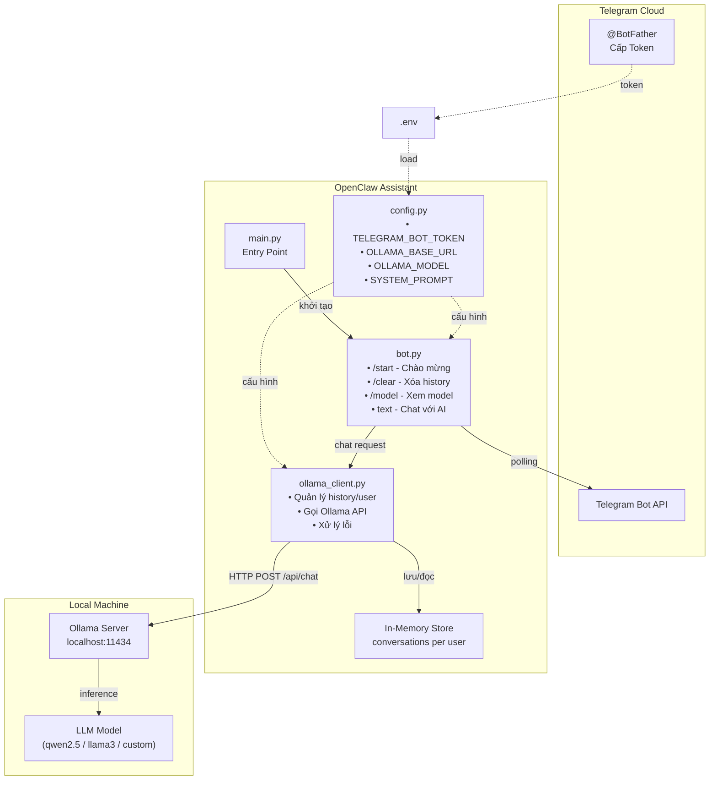
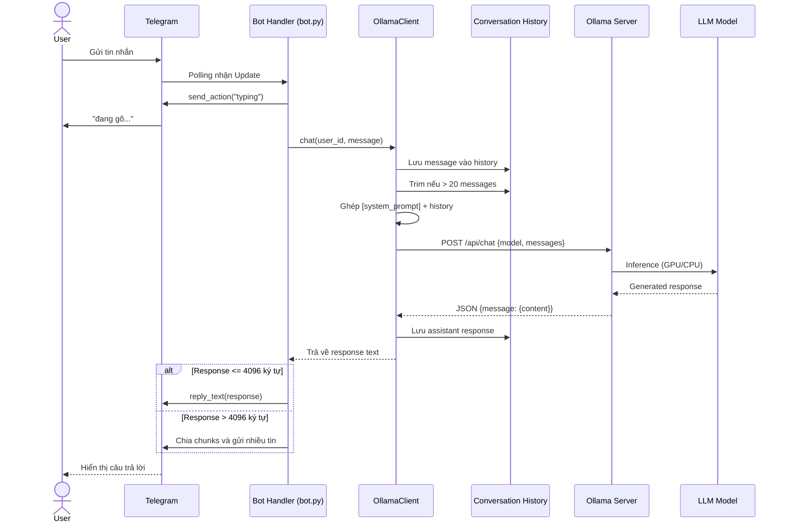
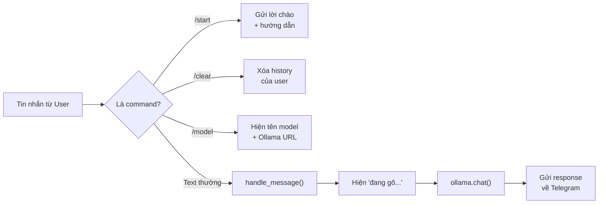

# OpenClaw Assistant

Telegram bot trò chuyện AI sử dụng model local qua Ollama.
Có 2 chế độ: **OpenClaw gateway** (đầy đủ tính năng) hoặc **bot Python đơn giản**.

## Quick Start

```bash
# Bước 0: Kiểm tra phần cứng & gợi ý model
./check-hardware.sh

# Bước 1: Deploy model (tự detect Ollama registry / HuggingFace / local GGUF)
./deploy-model.sh

# Bước 2: Deploy OpenClaw + Telegram
./deploy.sh
```

Hoặc truyền model trực tiếp (auto detect nguồn):

```bash
# Ollama registry
./deploy-model.sh qwen2.5:14b

# HuggingFace repo
./deploy-model.sh huihui-ai/Qwen2.5-14B-Instruct-abliterated-v2-GGUF

# HuggingFace URL
./deploy-model.sh https://huggingface.co/huihui-ai/Qwen2.5-14B-Instruct-abliterated-v2-GGUF

# File GGUF local
./deploy-model.sh ~/models/model.Q4_K_M.gguf
```

## Deploy Scripts

| Script | Mục đích |
|--------|----------|
| `check-hardware.sh` | Kiểm tra CPU, RAM, GPU, disk & gợi ý model phù hợp |
| `deploy-model.sh` | Deploy model từ mọi nguồn (Ollama / HuggingFace / GGUF local) |
| `deploy.sh` | Cài OpenClaw, cấu hình Telegram + Ollama, khởi động gateway |

### check-hardware.sh

- Detect CPU, RAM (total/available + progress bar), GPU (NVIDIA/AMD/Apple Silicon)
- Hỗ trợ WSL2 (detect GPU qua `/usr/lib/wsl/lib/nvidia-smi`)
- Liệt kê 24 model phổ biến với trạng thái OK/Thiếu RAM
- Đề xuất model lớn nhất phù hợp với phần cứng

### deploy-model.sh

- **Auto detect nguồn** từ input: Ollama registry, HuggingFace repo/URL, file GGUF local
- Cài Ollama nếu chưa có, khởi động server
- **Ollama registry** → `ollama pull`, nếu fail → tự hỏi chuyển sang HuggingFace
- **HuggingFace** → list file GGUF, chọn quantization, tải, tạo Modelfile, import Ollama
- **GGUF local** → scan file trên máy, tạo Modelfile, import Ollama
- 6 preset abliterated models (Qwen2.5, DeepSeek, Llama3, Mistral)
- Chọn chat template (ChatML, Llama3, Mistral)
- Test model + set default cho OpenClaw

### deploy.sh

- Kiểm tra Ollama đã chạy (tự gọi `deploy-model.sh` nếu chưa)
- Cài Node.js, lsof (Linux)
- Cài OpenClaw (`npm install -g openclaw`)
- Hỏi Telegram Bot Token (từ @BotFather)
- Set `OLLAMA_API_KEY`, `gateway.mode`, `dmPolicy`, model
- Cài Python venv + dependencies (cho bot đơn giản)
- Chọn chạy: OpenClaw gateway hoặc bot Python

## Dùng custom model từ HuggingFace

```bash
# Interactive menu (chọn preset hoặc nhập repo)
./deploy-model.sh

# Hoặc truyền repo trực tiếp
./deploy-model.sh huihui-ai/Qwen2.5-14B-Instruct-abliterated-v2-GGUF

# Hoặc URL
./deploy-model.sh https://huggingface.co/huihui-ai/Qwen2.5-14B-Instruct-abliterated-v2-GGUF
```

Script tự động: tải GGUF → chọn quantization → tạo Modelfile → import Ollama → test → set OpenClaw default.

## Kiến trúc hệ thống



## Flow hoạt động



## Xử lý commands



## Cấu trúc project

```
openclaw-assistance/
├── check-hardware.sh    # Kiểm tra phần cứng & gợi ý model
├── deploy-model.sh      # Deploy model (Ollama / HuggingFace / GGUF)
├── deploy.sh            # Deploy OpenClaw + Telegram
├── main.py              # Entry point (bot đơn giản)
├── app/
│   ├── config.py        # Cấu hình (env vars)
│   ├── ollama_client.py # Giao tiếp với Ollama API
│   └── bot.py           # Telegram bot handlers
├── .env.example         # Mẫu biến môi trường
└── requirements.txt     # Python dependencies
```

## Cài đặt thủ công

<details>
<summary>Nếu không dùng deploy scripts</summary>

### 1. Cài Ollama

```bash
# macOS
brew install ollama

# Linux
curl -fsSL https://ollama.com/install.sh | sh
```

### 2. Pull model & chạy

```bash
ollama pull qwen2.5:14b
ollama serve
```

### 3. Tạo Telegram Bot

- Mở Telegram, tìm **@BotFather**
- Gửi `/newbot` và làm theo hướng dẫn
- Copy token nhận được

### 4. Chạy bot đơn giản (Python)

```bash
cp .env.example .env
# Sửa .env, điền TELEGRAM_BOT_TOKEN

python3 -m venv .venv
source .venv/bin/activate
pip install -r requirements.txt
python main.py
```

### 5. Hoặc chạy OpenClaw gateway

```bash
sudo npm install -g openclaw@latest
export OLLAMA_API_KEY=ollama-local
export TELEGRAM_BOT_TOKEN=your_token_here
openclaw config set gateway.mode local
openclaw config set channels.telegram.enabled true
openclaw config set channels.telegram.dmPolicy open
openclaw models set ollama/qwen2.5:14b
openclaw gateway
```

</details>

## GPU Support

Ollama tự detect GPU và ưu tiên chạy trên GPU nếu có.

| Platform | GPU | Ghi chú |
|----------|-----|---------|
| Linux | NVIDIA (CUDA) | Tự động |
| Linux | AMD (ROCm) | Tự động |
| macOS | Apple Silicon | Unified memory, tự động |
| WSL2 | NVIDIA passthrough | Cần driver Windows 470+, CUDA lib có sẵn tại `/usr/lib/wsl/lib/` |

Kiểm tra GPU đang được dùng:

```bash
ollama ps   # Cột PROCESSOR hiện 100% GPU hoặc 100% CPU
```

## Sử dụng trên Telegram

- `/start` - Bắt đầu trò chuyện
- `/clear` - Xóa lịch sử hội thoại
- `/model` - Xem model đang sử dụng
- Gửi tin nhắn bất kỳ để chat với AI

## Đổi model

```bash
# Dùng deploy script (auto detect nguồn)
./deploy-model.sh qwen2.5:14b                    # Ollama registry
./deploy-model.sh huihui-ai/Qwen2.5-14B-...-GGUF # HuggingFace
./deploy-model.sh ~/models/custom.gguf            # File local
```

## Troubleshooting

<details>
<summary>Các lỗi thường gặp và cách fix</summary>

### Gateway: "port already in use" / "gateway already running"

```bash
# Dừng gateway
openclaw gateway stop

# Nếu vẫn lỗi, kill process trực tiếp
kill $(lsof -ti:18789) 2>/dev/null
# Hoặc
kill -9 <PID>

# Chạy lại
openclaw gateway
```

### Gateway: "gateway.mode is unset"

```bash
openclaw config set gateway.mode local
openclaw gateway
```

### OpenClaw: "Unrecognized key: llm"

Config cũ có key không hợp lệ. Xóa và tạo lại:

```bash
rm ~/.openclaw/openclaw.json
./deploy.sh
```

### OpenClaw: "models.providers.ollama.models: expected array"

Ollama provider cần khai báo models array đầy đủ. Chạy:

```bash
python3 -c "
import json, os
cfg = os.path.expanduser('~/.openclaw/openclaw.json')
with open(cfg) as f: c = json.load(f)
c.setdefault('models',{}).setdefault('providers',{})['ollama'] = {
    'baseUrl':'http://127.0.0.1:11434','apiKey':'ollama-local','api':'ollama',
    'models':[{'id':'qwen2.5:14b','name':'Qwen2.5 14B','reasoning':False,
    'input':['text'],'cost':{'input':0,'output':0,'cacheRead':0,'cacheWrite':0},
    'contextWindow':32768,'maxTokens':32768}]
}
with open(cfg,'w') as f: json.dump(c,f,indent=2)
"
```

### OpenClaw: "Unknown model: ollama/..." / "OLLAMA_API_KEY"

OpenClaw cần `OLLAMA_API_KEY` để nhận Ollama provider:

```bash
export OLLAMA_API_KEY=ollama-local
openclaw gateway
```

Hoặc lưu vĩnh viễn:

```bash
echo 'OLLAMA_API_KEY=ollama-local' >> ~/.openclaw/.env
```

### OpenClaw: "No pending pairing request"

Mã pairing đã hết hạn. Gửi tin nhắn mới trên Telegram để tạo mã mới, hoặc tắt pairing:

```bash
openclaw config set channels.telegram.dmPolicy open
openclaw gateway stop && openclaw gateway
```

### Ollama: "model requires more system memory"

Model quá lớn cho RAM/VRAM hiện tại:

```bash
# Kiểm tra phần cứng
./check-hardware.sh

# Chuyển sang model nhỏ hơn
./deploy-model.sh qwen2.5:14b   # 14B cần ~10GB
./deploy-model.sh qwen2.5:7b    # 7B cần ~5GB
```

### Ollama: "could not connect to ollama server"

```bash
# WSL2 không có systemd → chạy trực tiếp
ollama serve &
sleep 2
ollama run qwen2.5:14b "test"
```

### WSL2: GPU không được detect

```bash
# Kiểm tra driver passthrough
ls /usr/lib/wsl/lib/nvidia-smi && /usr/lib/wsl/lib/nvidia-smi

# Nếu có output → thêm vào PATH
export PATH=$PATH:/usr/lib/wsl/lib

# Kiểm tra Ollama dùng GPU
ollama ps
```

### WSL2: RAM hiện "?GB" trong check-hardware.sh

Script cũ dùng `bc` (không có sẵn trên WSL2). Pull bản mới:

```bash
git pull
./check-hardware.sh
```

### pip: "externally-managed-environment"

Trên Kali/Debian 12+/Ubuntu 24+:

```bash
pip install --user huggingface-hub
# Hoặc
pip install --break-system-packages huggingface-hub
# Hoặc
pipx install huggingface-hub
```

### deploy-model.sh: "Không tìm thấy file GGUF"

- Repo gốc (safetensors) không có GGUF. Script tự thử thêm `-GGUF` suffix
- Chạy **không có sudo** (sudo dùng root Python, thiếu module):

```bash
./deploy-model.sh huihui-ai/Qwen2.5-14B-Instruct-abliterated-v2
# KHÔNG dùng: sudo ./deploy-model.sh
```

### npm: "EACCES permission denied"

```bash
sudo npm install -g openclaw@latest
# Hoặc fix permissions
sudo chown -R $(whoami) /usr/lib/node_modules/openclaw/
```

### NVIDIA CUDA repo GPG error trên WSL2

```bash
# Xóa CUDA repo (WSL2 đã có CUDA sẵn tại /usr/lib/wsl/lib/)
sudo rm -f /etc/apt/sources.list.d/cuda-wsl-ubuntu-x86_64.list
sudo apt-get update
```

</details>
