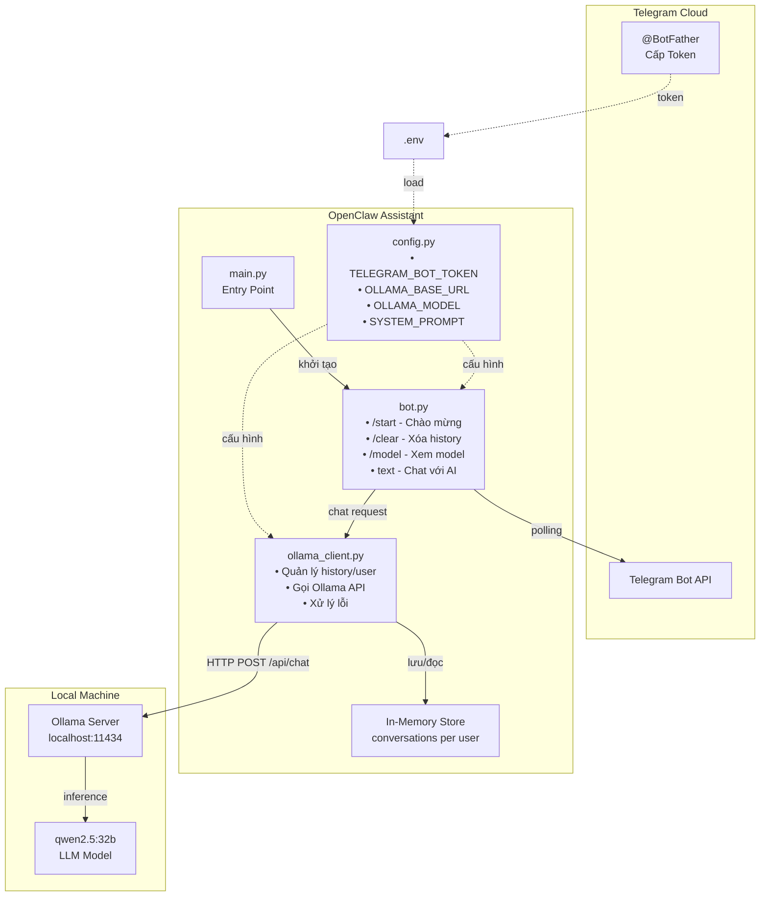
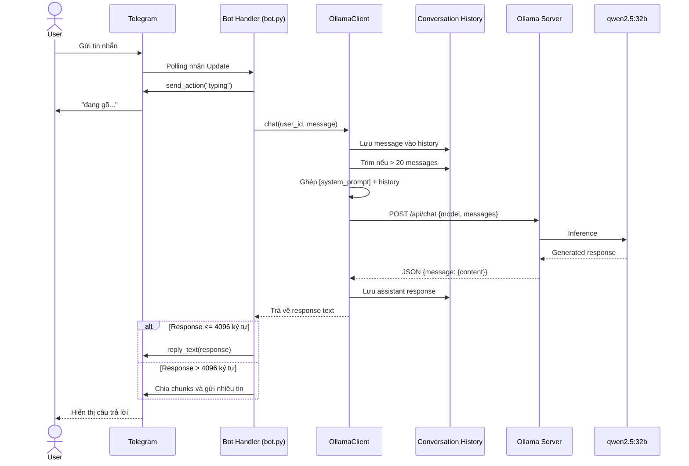
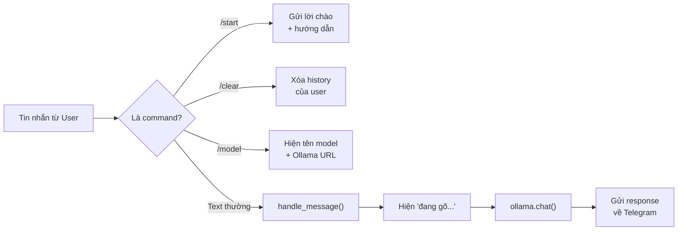

# OpenClaw Assistant

Telegram bot trò chuyện AI sử dụng model local qua Ollama (mặc định: `qwen2.5:32b`).
Có 2 chế độ: **OpenClaw gateway** (đầy đủ tính năng) hoặc **bot Python đơn giản**.

## Quick Start

```bash
# Bước 1: Deploy Ollama + pull model
./deploy-ollama.sh

# Bước 2: Deploy OpenClaw + Telegram
./deploy.sh
```

Hoặc chỉ định model:

```bash
OLLAMA_MODEL=llama3:8b ./deploy-ollama.sh
OLLAMA_MODEL=llama3:8b ./deploy.sh
```

## Deploy Scripts

| Script | Mục đích |
|--------|----------|
| `deploy-ollama.sh` | Cài Ollama, khởi động server, chọn & pull model |
| `deploy.sh` | Cài OpenClaw, cấu hình Telegram + Ollama, khởi động gateway |

### deploy-ollama.sh

- Cài Ollama (brew trên macOS, install script trên Linux)
- Khởi động Ollama server
- Liệt kê model đã có, cho phép chọn hoặc nhập model mới
- Pull model nếu chưa có
- Test model bằng 1 câu nhanh (tùy chọn)

### deploy.sh

- Kiểm tra Ollama đã chạy (tự gọi `deploy-ollama.sh` nếu chưa)
- Cài Node.js, lsof (Linux)
- Cài OpenClaw (`npm install -g openclaw`)
- Hỏi Telegram Bot Token (từ @BotFather)
- Set `OLLAMA_API_KEY`, `gateway.mode`, `dmPolicy`, model
- Cài Python venv + dependencies (cho bot đơn giản)
- Chọn chạy: OpenClaw gateway hoặc bot Python

## Kiến trúc hệ thống



## Flow hoạt động



## Xử lý commands



## Cấu trúc project

```
openclaw-assistance/
├── deploy-ollama.sh     # Deploy Ollama + model
├── deploy.sh            # Deploy OpenClaw + Telegram
├── main.py              # Entry point (bot đơn giản)
├── app/
│   ├── config.py        # Cấu hình (env vars)
│   ├── ollama_client.py # Giao tiếp với Ollama API
│   └── bot.py           # Telegram bot handlers
├── .env.example         # Mẫu biến môi trường
└── requirements.txt     # Python dependencies
```

## Cài đặt thủ công

<details>
<summary>Nếu không dùng deploy scripts</summary>

### 1. Cài Ollama

```bash
# macOS
brew install ollama

# Linux
curl -fsSL https://ollama.com/install.sh | sh
```

### 2. Pull model & chạy

```bash
ollama pull qwen2.5:32b
ollama serve
```

### 3. Tạo Telegram Bot

- Mở Telegram, tìm **@BotFather**
- Gửi `/newbot` và làm theo hướng dẫn
- Copy token nhận được

### 4. Chạy bot đơn giản (Python)

```bash
cp .env.example .env
# Sửa .env, điền TELEGRAM_BOT_TOKEN

python3 -m venv .venv
source .venv/bin/activate
pip install -r requirements.txt
python main.py
```

### 5. Hoặc chạy OpenClaw gateway

```bash
sudo npm install -g openclaw@latest
export OLLAMA_API_KEY=ollama-local
export TELEGRAM_BOT_TOKEN=your_token_here
openclaw config set gateway.mode local
openclaw config set channels.telegram.enabled true
openclaw config set channels.telegram.dmPolicy open
openclaw models set ollama/qwen2.5:32b
openclaw gateway
```

</details>

## Sử dụng trên Telegram

- `/start` - Bắt đầu trò chuyện
- `/clear` - Xóa lịch sử hội thoại
- `/model` - Xem model đang sử dụng
- Gửi tin nhắn bất kỳ để chat với AI

## Đổi model

```bash
OLLAMA_MODEL=llama3:8b ./deploy-ollama.sh   # Pull model mới
openclaw models set ollama/llama3:8b         # Đổi model OpenClaw
```
