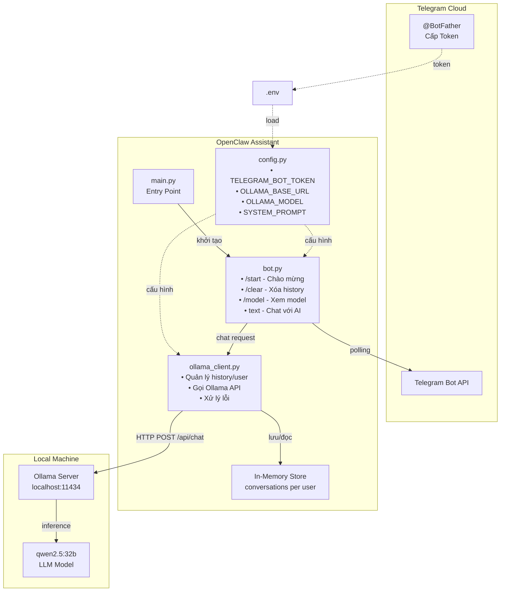
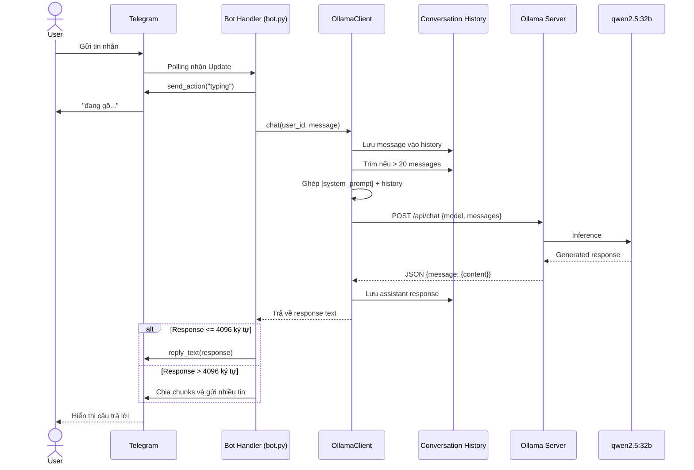
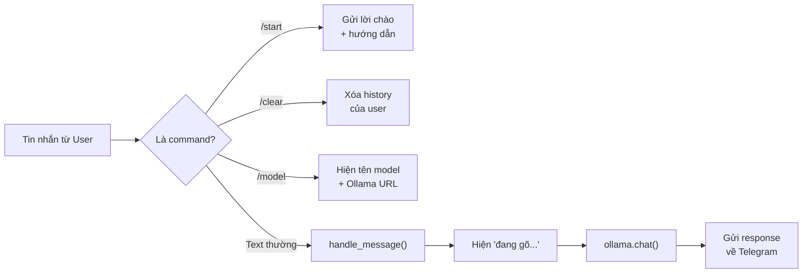

# OpenClaw Assistant

Telegram bot trò chuyện AI sử dụng model local qua Ollama (mặc định: `qwen2.5:32b`).

## Kiến trúc hệ thống



## Flow hoạt động



## Xử lý commands



## Cấu trúc

```
openclaw-assistance/
├── main.py              # Entry point
├── app/
│   ├── config.py        # Cấu hình (env vars)
│   ├── ollama_client.py # Giao tiếp với Ollama API
│   └── bot.py           # Telegram bot handlers
├── .env.example         # Mẫu biến môi trường
└── requirements.txt     # Dependencies
```

## Cài đặt

### 1. Cài Ollama

```bash
# macOS
brew install ollama

# Hoặc tải từ https://ollama.com
```

### 2. Pull model

```bash
ollama pull qwen2.5:32b
```

### 3. Chạy Ollama

```bash
ollama serve
```

### 4. Tạo Telegram Bot

- Mở Telegram, tìm **@BotFather**
- Gửi `/newbot` và làm theo hướng dẫn
- Copy token nhận được

### 5. Cấu hình project

```bash
cp .env.example .env
# Sửa .env, điền TELEGRAM_BOT_TOKEN
```

### 6. Cài dependencies và chạy

```bash
python3 -m venv .venv
source .venv/bin/activate
pip install -r requirements.txt
python main.py
```

## Sử dụng

- `/start` - Bắt đầu trò chuyện
- `/clear` - Xóa lịch sử hội thoại
- `/model` - Xem model đang sử dụng
- Gửi tin nhắn bất kỳ để chat với AI

## Đổi model

Sửa `OLLAMA_MODEL` trong file `.env`:

```
OLLAMA_MODEL=llama3:8b
```
